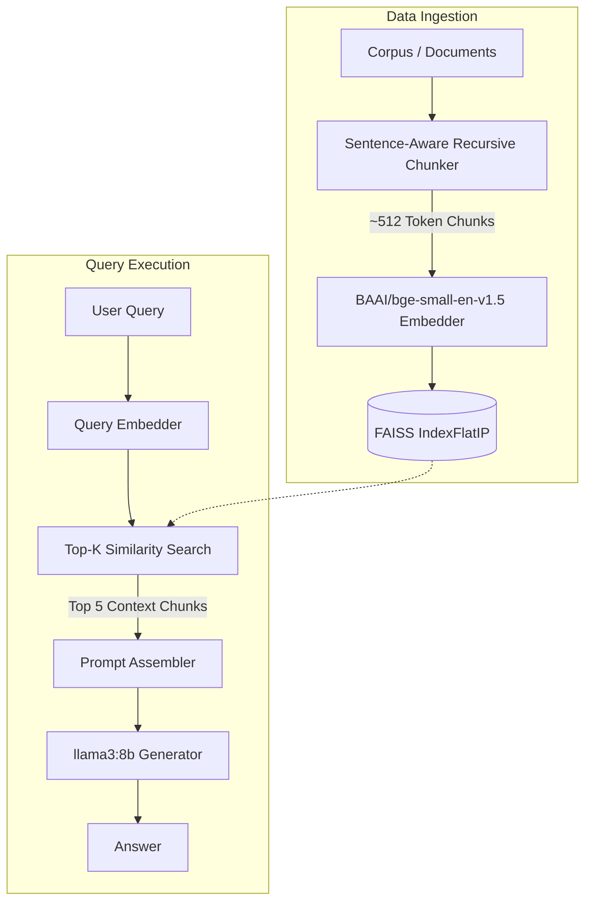

# Architecture

This document describes the high-level architecture of the **RAGL A0 Reference Implementation**.

## The A0 Reference Pipeline

The RAGL pipeline prioritizes simplicity and robust engineering over speculative complexity. The current validated architecture (v1.0) is entirely synchronous and relies on a dense embedding retrieval strategy.

### Components
- **Chunker**: A recursive character text splitter that attempts to respect sentence boundaries to preserve semantic context.
- **Embedder**: `bge-small-en-v1.5` mapping text to 384-dimensional dense vectors.
- **Indexer**: Facebook AI Similarity Search (FAISS) utilizing Inner Product (`IndexFlatIP`) for rapid vector retrieval.
- **Generator**: A local execution of the `llama3:8b` model via Ollama, initialized with a minimal zero-shot groundedness prompt.

All architectural modifications (Rerankers, BM25, Agents) are introduced as strict `A*` experiments branching from this baseline.
